# Generate machine learning model pipelines to choose the best model for your problem: AutoAI

## Introduction
It was inevitable to expect artificial intelligence, which facilitates every aspect of our lives, to facilitate its own development process. Building better models requires more complex, time-intensive and costly AI procedures, which requires expertise from cleansing the data to feature engineering, designing the architectures to parameter optimization. In order to ease this process and make it efficient in terms of time and effort, we need to automate these workloads. With the aim of creating AI for AI, IBM introduced the new service on Watson Studio called, AutoAI.

AutoAI is a service which automates machine learning tasks so that it eases the tasks of data scientists. It automatically prepares your data for the modeling, makes feature engineering on it, chooses the best algorithm for your problem and creates pipelines for the trained models.


## Learning Objectives

In this tutorial, the aim is to show the benefits of this service on a use case so that we can have a better understanding of how regression and classification problems can be handled without any code and how the tasks (feature engineering, model selection, hyperparameter tuning etc.) are done with this service. Then, the tutorial will include the details of how to choose the best model among the pipelines and how to deploy and use these models.

## Prerequisites

  * Sign up for an IBM Cloud account (This tutorial can be completed using an IBM Cloud Lite account)
  * Create a Cloud Object Storage service instance
  * Create a Watson Studio service instance
  * Create a Watson Machine Learning service instance
  * Basic knowledge of machine learning algorithms

## Estimated Time

This tutorial takes approximately 20 minutes to complete including the training part in AutoAI.

## Steps
IBM Cloud Lite account can be created by using this [link](https://cloud.ibm.com/registration). After completing the signing process, you can follow the steps below.

### Step 1: Create Required Service Instances

### i.	Object Storage
In order to store the data, we need a storage service which is going to be linked with our project later on. To do that:
*	Search for Storage in the [IBM Cloud Catalog](https://cloud.ibm.com/catalog?search=object%20storage&category=storage) or directly go to Storage tab from the left menu from the same page and click Object Storage service.

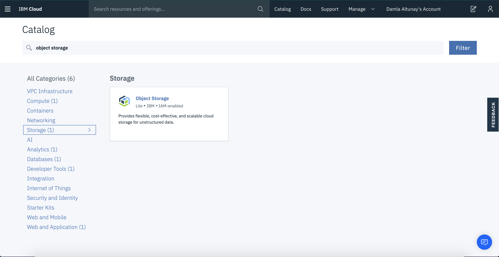

* From the upcoming page, optionally you can give a name to this service instance and click **Create**.

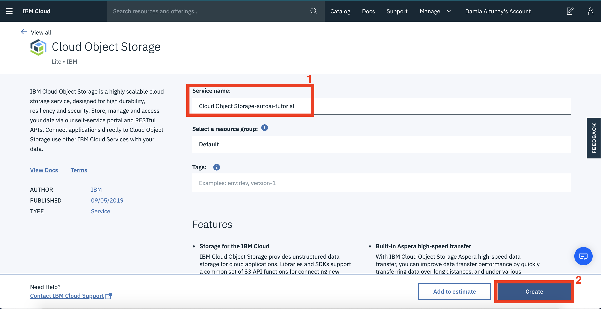

### ii.	Watson Studio
* Search for Studio in the [IBM Cloud Catalog](https://cloud.ibm.com/catalog?search=studio) and click the **Watson Studio** service tile.

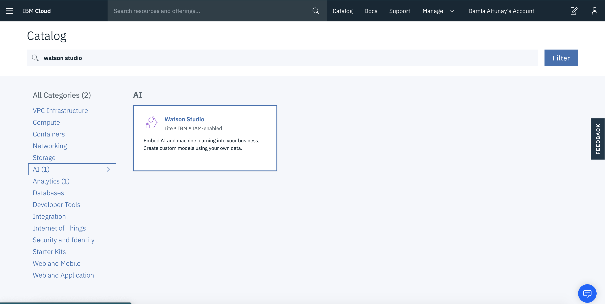

*	As done with the Object Storage service, you can name your service and click **Create**.

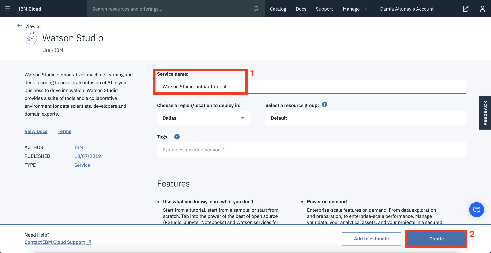

*	After provisioning the Watson Studio service, click **Get Started** or directly go to [Watson Studio](https://dataplatform.cloud.ibm.com/) platform and login with your IBM Cloud account.

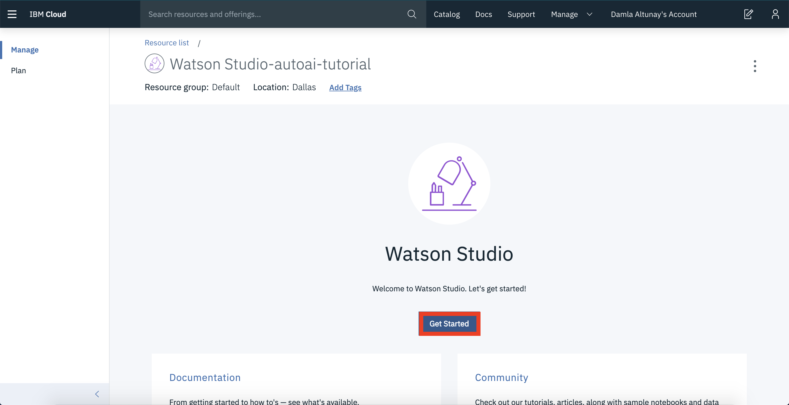

*	You can review the introductory tutorial to learn about Watson Studio.


### Step 2: Train a model with AutoAI
Watson Studio is an integrated platform designed to organize your project assets, like datasets, collaborators, models, notebooks. 
We are going to use Watson Studio to create a project in which we are planning to train a model with AutoAI and deploy this trained model.

### i.	Create a Watson Studio Project
*	Click **Create** a Project.

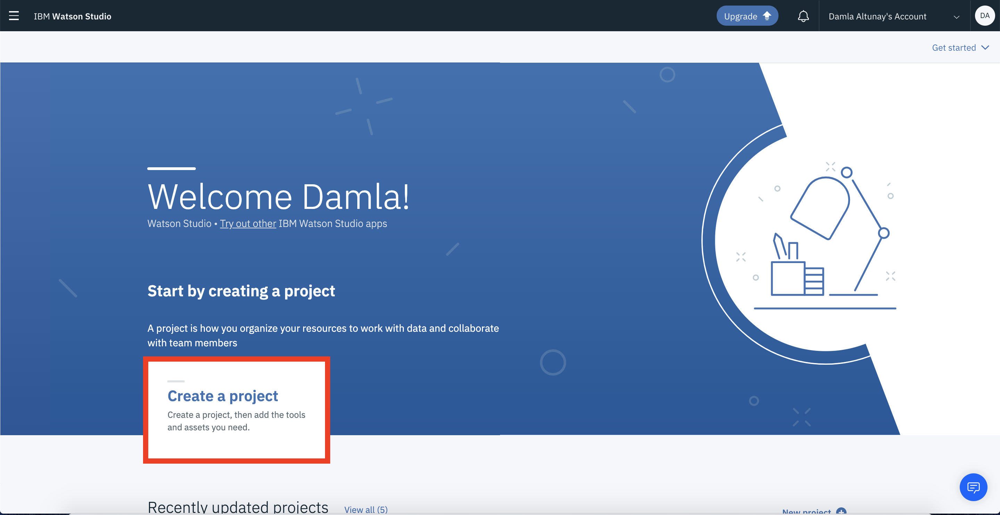

* Select **Create an empty project**

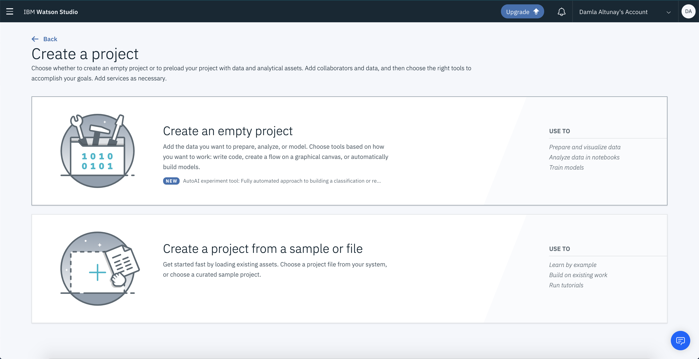

*	Give a name your project. If you have a Lite account, the Object Storage service that we created in the previous step, will be selected automatically, otherwise select a service from the dropdown menu.

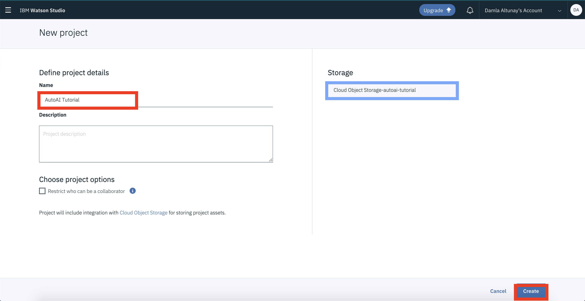

*	This upcoming page is where your project assets are stored and organized. By clicking **Assets** bar, you can load your dataset from the left interface. 
*	Upload [dataset](../dataset/german_credit_data.csv) 

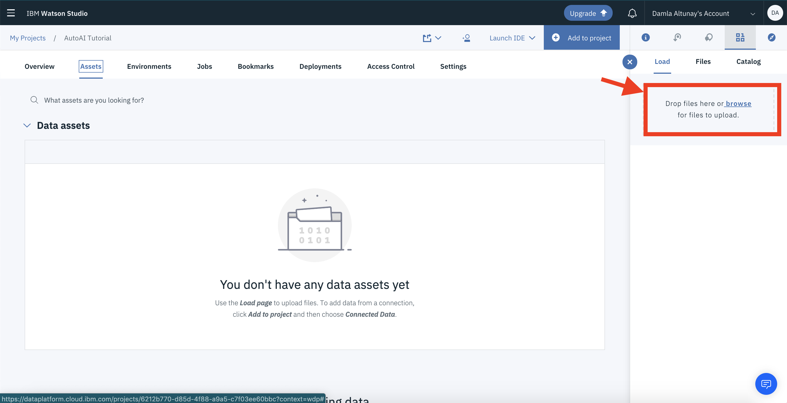


### ii.	Set up your AutoAI environment and generate pipelines
*	To start the AutoAI experience, click **Add to Project** from the top and select **AutoAI**.

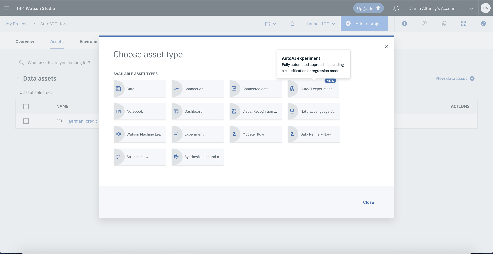

*	Give your service a name.

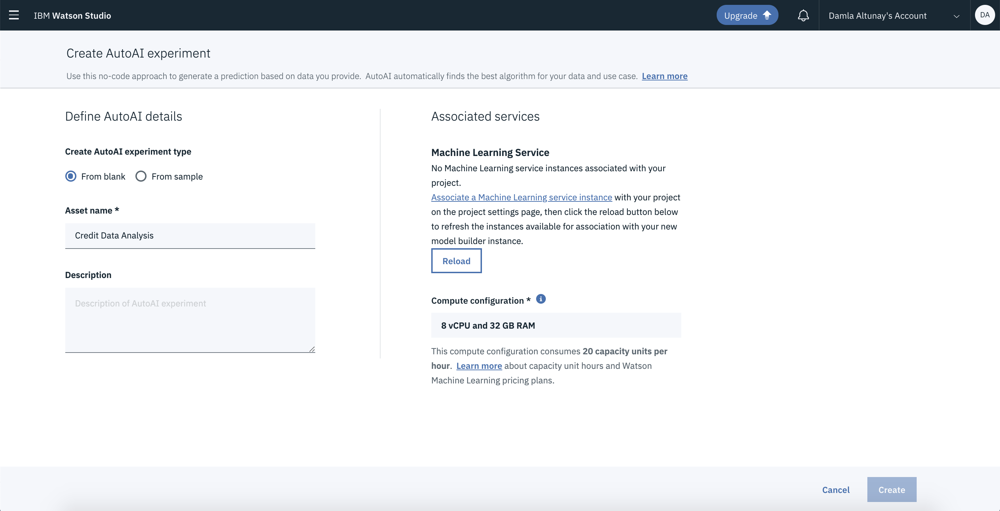

*	In order to associate a **Watson Machine Learning** instance, click to the given link. If you have an existing instance, select it from the Existing tab. If not, create a new one from the New tab. 

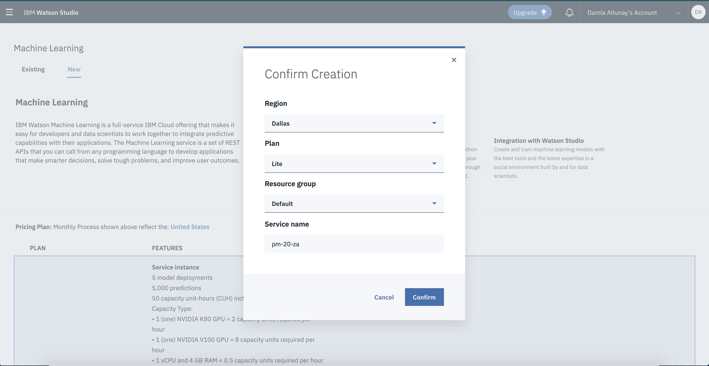

*	After provisioning your WML instance, it will redirect you again the same page and click **Reload**, then **Create**.
*	Select your dataset (you can upload it from your local or select from project)

#### --> Information about the dataset
   * Minimizing the risk along with maximizing the profit requires some basic rules for the banks. As one of the first goal, they  need to minimize their loss in any interaction with the customer such as in giving loans. The aim of this dataset is to predict if the customer will be able to repay the loan by considering their applicants' demographic and socio-economic profiles.

        * If the applicant is a good credit risk i.e. is likely to repay the loan, then not approving the loan to the person results in a loss of business to the bank

        * If the applicant is a bad credit risk i.e. is not likely to repay the loan, then approving the loan to the person results in a financial loss to the bank

     * The dataset consists of 1000 loan applicants’ data points each with 20 variables: 7 are numerical and 13 are categorical. We will not get into much details about the variables of this dataset. You can check all detailed information from this [link] (https://archive.ics.uci.edu/ml/datasets/Statlog+%28German+Credit+Data%29).

*	To set up your AutoAI instance, you can follow the video below.

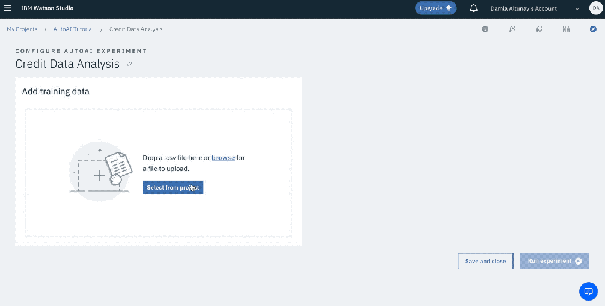

#### --> AutoAI Pipeline
* The experiment will begin just after you completed the processes above. 
* The AutoAI process follows this sequence to build candidate pipelines:
    *	Data pre-processing
    *	Automated model selection (Pipeline 1)
    * Hyperparameter optimization (Pipeline 2)
    *	Automated feature engineering (Pipeline 3)
    *	Hyperparameter optimization (Pipeline 4)

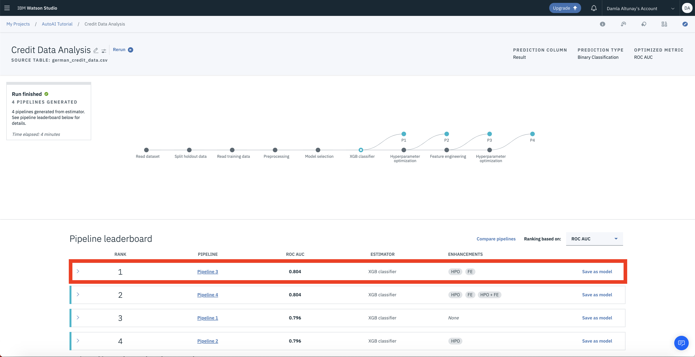

*	Next step is to select the model which gives the best result by looking at the metrics. In our case Pipeline3 gave the best result with our metric: Area under the ROC Curve (ROC AUC).
*	You can view the detailed results by clicking the corresponding pipeline from the leaderboard. In addition, you can save your model pipeline by clicking **Save as model** from the leaderboard or pipeline page. We are going to simple save the model which gives the best result for us.

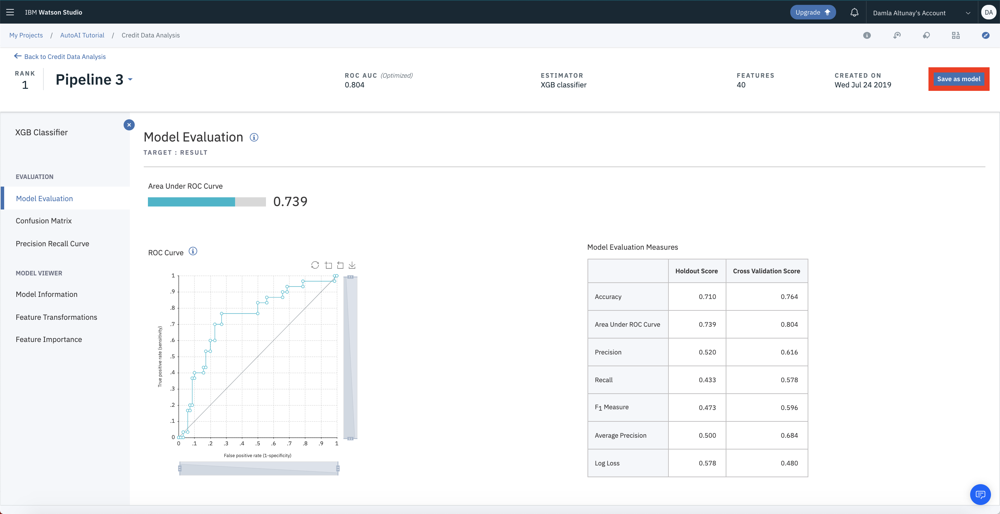

*	It will pop-up a window which asks the model name, description (optional) etc. After completing this fields, click **Save**.

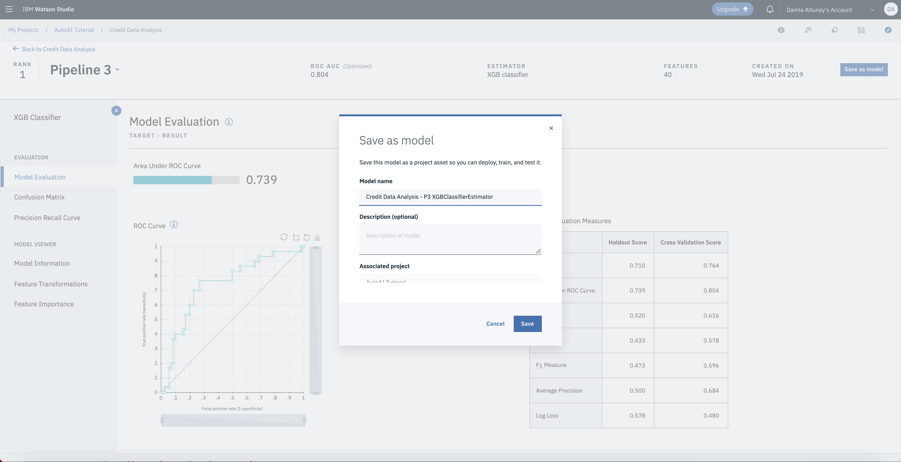

*	You will take a notification as below to indicate your model is saved to your project. Click **View in project**.

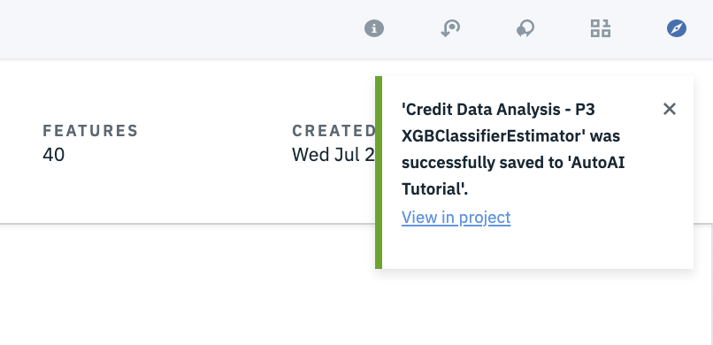

### iii.	Deploy and Test the model 
*	To make the model ready for deployment, click **Deployments** tab and **Add Deployment**.


*	You can refer to the video below for the next steps.


*	Now you can test your model from the interface provided after the deployment. You can either provide your input in JSON format or enter the input details to the fields given in the interface.
    * Input with JSON format 
    
    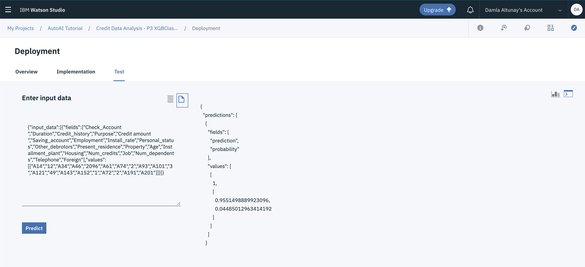
  
                        
    * Input to the fields
    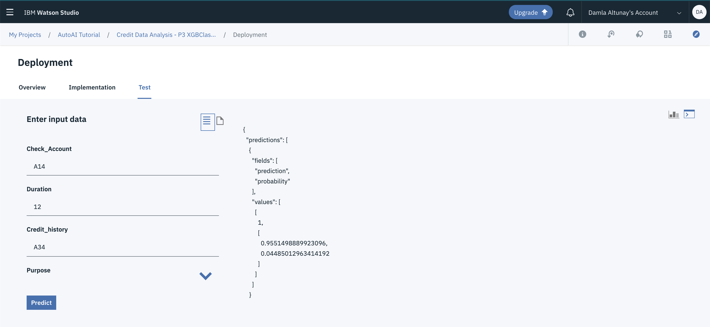

     
```
   Input data: 
   {"input_data": [{"fields": ["Check_Account ", "Duration", "Credit_history", "Purpose", "Credit amount ", "Saving_account", "Employment", "Install_rate", "Personal_status", "Other_debrotors", "Present_residence", "Property", "Age", "Installment_plant", "Housing", "Num_credits", "Job", "Num_dependents", "Telephone", "Foreign"], 
                                 "values": [["A14", "48", "A34", "A43", "3573", "A65", "A75", "4", "A93", "A101","1","A121","47","A143","A152","1","A173","1","A192","A201"]]}]}
```

*	You can also use deployed models in your applications by making API calls. In order to show a use case, we are going to call our model from Notebook. To do so, go back to your Project Assets page and click **Add to project** and select **Notebook**.

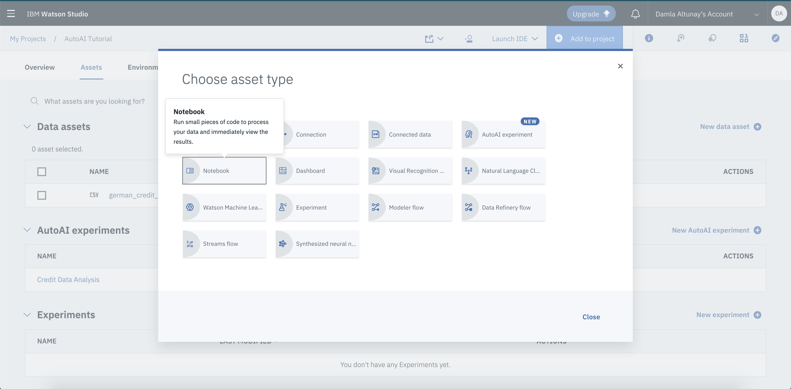

*	You can create notebooks in three ways. 
   * Create a blank notebook
   *	Import a notebook file (.ipynb) from your local device.
   *	Import a notebook from URL

* In this demo, we are going to upload a notebook from file (Test WML model.ipynb).

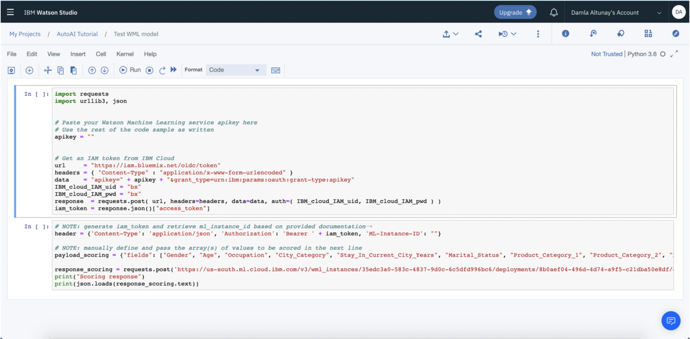

*	In the first cell, you need to enter your Watson Machine Learning API key. At the end of this cell, you will be given an access token from IBM Cloud.
*	Second cell is the part where you call the model and make predictions. 

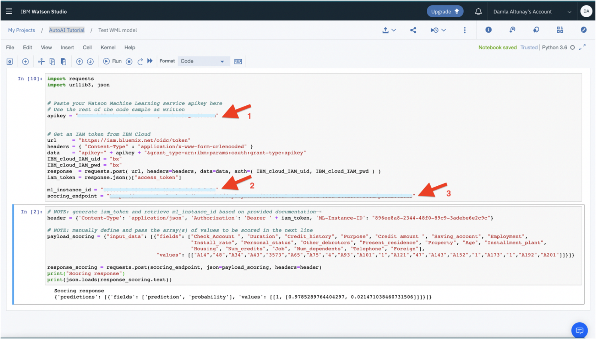


## Conclusion
In this tutorial, we tried to explain how to train your model with IBM Watson’s service: AutoAI. Along with this training process, you have learned how to deploy and test the models. You also had an understanding of how to make an API call for the deployed model via Notebook. 


                           


